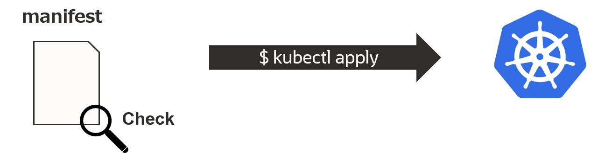
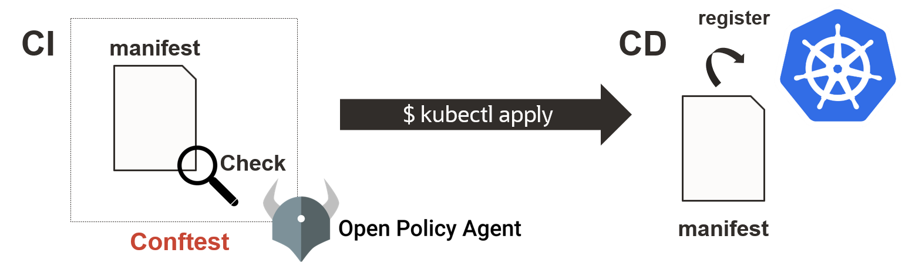

# Chapter Advance 1 Policy Check of manifests

ここからは、マニフェストのセキュリティ対策としてCodeリポジトリからConfigリポジトリへのプルリクエストをトリガーにConftestを利用したOpen Policy Agent(OPA)によるポリシーチェックについて学びます。

# Policy Check

Kubernetesのすべてのリソースは、マニフェストに記述して登録します。そのマニフェストの内容が正しいか、許可できるものかをチェックしてセキュリティを向上する必要があります。



GitOpsではCIにConftestというツールを用いて、Kubernetesクラスタ登録前にポリシーチェックを行います。ポリシーチェックには、Open Policy Agentが利用されています。



ConftestとOpen Policy Agent（OPA）については、次のチャプターで説明します。

# Github Actionsの設定

本ハンズオンでは、CodeリポジトリからConfigリポジトリにプルリクエストするタイミングで、Configリポジトリに設定するCI（GitHub Actions）を利用してポリシーチェックを行います。
GitHub Actionsの設定方法は、Codeリポジトリと同様です。Configリポジトリの「.github/workflows/main.yml」に定義します。
Codeリポジトリの設定では、Git Push をトリガーにしましたが、今回はプルリクエストをトリガーにします。

まずは、ローカルにConfigリポジトリからクローンしたディレクトリに移動します。

```bash
$ cd ./cicd-handson-2021-config/
```

GitHub Actionsの専用ディレクトリとmain.yamlを作成します。

```bash
$ mkdir -p .github/workflows
```

以下作成するmain.ymlの内容です。

アクションは、[Validate Kubernetes manifests by conftest](https://github.com/makocchi-git/actions-k8s-manifests-validate-conftest) を利用します。
以下トリガー定義と指定の格納場所に対象のファイルを格納するだけで、ConftestをCI時に実行できます。

* 「on: [pull_request]」：プルリクエストをトリガーにする定義
* 「jobs.validation.steps.name.with.file」：ポリシーチェックするマニフェストのパス指定
* 「jobs.validation.steps.name.with.policy」：OPAのポリシーファイルのパス指定

```yaml
name: Policy Check

on: [pull_request]

jobs:
  validation:
    runs-on: ubuntu-latest
    steps:
      - uses: actions/checkout@v2
      - name: validate manifest-dir with custom policies
        uses: makocchi-git/actions-k8s-manifests-validate-conftest@v1.2.0
        with:
          file: manifests/goapp.yaml
          policy: manifests/policy/latest-tag-check.rego
          token: ${{ secrets.GITHUB_TOKEN }}
```

上記の内容のmain.ymlを作成します。

```bash
$ vi .github/workflows/main.yml
```

次のチャプターでConftestとOpen Policy Agent（OPA）の説明とポリシーファイルの作成します。

---

[Chapter Advance 2 Conftest & Open Policy Agent (OPA)](chapter-advance-2.md)へ