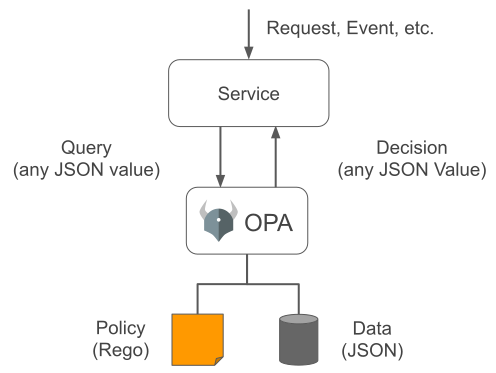
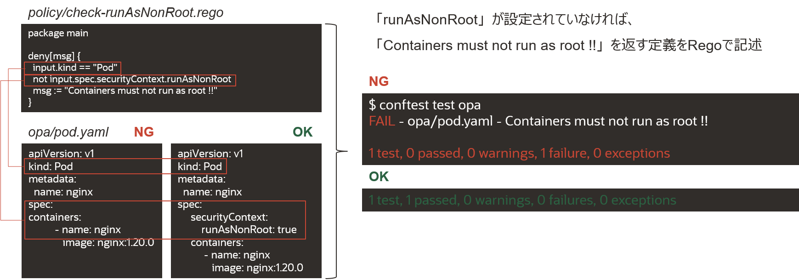

# Chapter Advance 2 Conftest & Open Policy Agent (OPA)

ここでは、Conftestを利用したOpen Policy Agent(OPA)によるポリシーチェックについて学びます。

# Open Policy Agent（OPA）

OPAは、オープンソースの汎用的なポリシーエンジンです。ポリシーに違反した情報を発見し、事前に定義されたアクションを実行する仕組みで、Regoという言語を使用してポリシーを定義します。
主な特徴は以下となります。

* 軽量で汎用性のあるOSSのポリシーエンジン
* Kubernetes専用というわけではなく、YAML、JSONなど構造化データのポリシーエンジン
* KubernetesではCI時に、Conftestとの組み合わせで導入するケースが多い
* CNCFのGraduationプロジェクト

APIにDataを送信する（Query）と、Policyを参照してDataを評価して結果（Decision）を返す仕組みです。



[OPA公式ドキュメント](https://www.openpolicyagent.org/docs/latest/)

# Conftest & Rego

Conftestは、バイナリファイルを所定のディレクトリに格納して、パスを通すことで簡単に利用できます。
Rego言語で定義したポリシーファイルと実際にチェックするファイルを所定のディレクトリに格納して、「$ conftest test <チェックするファイルまたはディレクトリのパス>」という形式でコマンドを実行して、定義したポリシーに違反していなければOK、NG場合はFAILを返します。

以下の例では、マニフェストファイルに「runAsNonRoot」が設定されていればOK、設定されていなければNGを返すポリシーをRegoで定義、実行しているものになります。



 [Conftest GitHub](https://github.com/open-policy-agent/conftest/)

本ハンズオンでは、マニフェスト内のイメージタグに「latest」がある場合をNGとする定義をRegoで作成します。
以下は、マニフェスト内のイメージタグに「latest」が定義されていたら、NGとして「Cannot use latest tag !!」を返すというポリシーです。

```go
package main

deny[msg] {
  input.image.tag == "latest"
  msg = "Cannot use latest tag !!"
}
```

このRegoで定義したファイルを「manifests/policy」というディレクトリを作成して、格納します。

```bash
$ mkdir -p ./manifests/policy
$ vi ./manifests/policy/latest-tag-check.rego
```

Regoも使いこなすにはそれなりの学習コストが必要となります。本ハンズオンでは初歩的な定義ですが、詳細は以下公式ドキュメントをご参照ください。

 [Rego Official Documents](https://www.openpolicyagent.org/docs/latest/policy-language/)

 これまでの変更をConfigリポジトリにプッシュします。

 ```git
$ git add .
$ git commit -m "Conftest and Rego"
$ git push origin main
```

プッシュ後に、CodeリポジトリからConfigリポジトリにプルリクエストが発行されたことをトリガーに、ポリシーチェックのCIが実行されて、OKとなります。マージするとこれまでと同じ処理の流れとなります。

# Conftest NG Attempt

実際に、ConftestでNGを確認するには、以下の流れとなります。

1. Codeリポジトリの「main.yml」ファイルの書き換え（イメージタグをlatestにする処理の追加）とプッシュ
2. ConfigリポジトリでNGの確認

Configリポジトリにプルリクエストを行う処理におけるイメージタグ書き換えの箇所に強制的にlatestタグになる処理に変更します。

```yaml
name: GitHub Actions CI

# mainブランチへの「git push」をトリガー
on:
  push:
    branches: [ main ]

jobs:
  build:
    name: GitOps Workflow
    runs-on: ubuntu-latest
    steps:
      - name: Checkout code
        uses: actions/checkout@v2

        # アプリケーションテスト
      - name: Application test
        run: |
          cd apps
          make run-test

        # BuildKitによるコンテナイメージビルド
      - name: Build an image from Dockerfile
        run: |
          DOCKER_BUILDKIT=1 docker image build apps/ -t docker.pkg.github.com/${{ github.repository }}/go-image:${{ github.run_number }}

        # dockleによるイメージ診断
      - name: Run dockle
        uses: hands-lab/dockle-action@v1
        with:
          image: docker.pkg.github.com/${{ github.repository }}/go-image:${{ github.run_number }}

        # Trivyによるイメージスキャン
      - name: Run Trivy vulnerability scanner
        uses: aquasecurity/trivy-action@master
        with:
          image-ref: 'docker.pkg.github.com/${{ github.repository }}/go-image:${{ github.run_number }}'
          format: 'table'
          exit-code: '1'
          ignore-unfixed: true
          severity: 'CRITICAL,HIGH'

        # イメージをプッシュする為の「docker login」
      - name: GitHub Packages login
        uses: docker/login-action@v1
        with:
          registry: docker.pkg.github.com
          username: ${{ secrets.USERNAME }}
          password: ${{ secrets.PERSONAL_ACCESS_TOKEN }}

        # コンテナイメージをGitHub Packagesに「docker image push」
      - name: Push image to GitHub Packages
        run: docker image push docker.pkg.github.com/${{ github.repository }}/go-image:${{ github.run_number }}

  # プルリクエストを作る job を新規で定義します
  # 「needs: build」を書いておくことで、build の job が終わった後に実行されるようにします
  create-pr-k8s-manifest:
    needs: build
    runs-on: ubuntu-latest
    steps:
      # config repo を checkout します
      - name: Checkout code
        uses: actions/checkout@v2
        with:
          token: ${{ secrets.PERSONAL_ACCESS_TOKEN }}
          repository: ${{ secrets.USERNAME }}/cicd-handson-2021-config

        # プルリクエスト用の新規ブランチを作成し、プッシュした後にプルリクエストを作成します
      - name: Pull Request to Config Repository
        run: |
          # GitHubログイン設定
          echo -e "machine github.com\nlogin ${{ secrets.USERNAME }}\npassword ${{ secrets.PERSONAL_ACCESS_TOKEN }}" > ~/.netrc
          # GitHub Email/Username セットアップ
          git config --global user.email "${{ secrets.EMAIL }}"
          git config --global user.name "${{ secrets.USERNAME }}"
          # 新規ブランチ作成
          git branch feature/${{ github.run_number }}
          git checkout feature/${{ github.run_number }}
          # image tagを書き換えます
          sed -i -e "s|image: docker.pkg.github.com/${{ github.repository }}/go-image:.*|image: docker.pkg.github.com/${{ github.repository }}/go-image:${{ github.run_number }}|" manifests/goapp.yaml
          # プッシュ処理
          git add manifests
          git commit -m "Update tag ${{ github.run_number }}"
          git push origin feature/${{ github.run_number }}
          # プルリクエスト処理
          echo ${{ secrets.PERSONAL_ACCESS_TOKEN }} > token.txt
          gh auth login --with-token < token.txt
          gh pr create  --title "Update Tag ${{ github.run_number }}" --body "Please Merge !!"
```

以下、Codeリポジトリで作成した「main.yml」です。

```
sed -i -e "s|image: docker.pkg.github.com/${{ github.repository }}/go-image:.*|image: docker.pkg.github.com/${{ github.repository }}/go-image:${{ github.run_number }}|" manifests/goapp.yaml
```

↓ `${{ github.run_number }}` を `latest` に変更

```
sed -i -e "s|image: docker.pkg.github.com/${{ github.repository }}/go-image:.*|image: docker.pkg.github.com/${{ github.repository }}/go-image:latest|" manifests/goapp.yaml
```

```yaml
name: GitHub Actions CI

# mainブランチへの「git push」をトリガー
on:
  push:
    branches: [ main ]

jobs:
  build:
    name: GitOps Workflow
    runs-on: ubuntu-latest
    steps:
      - name: Checkout code
        uses: actions/checkout@v2

        # アプリケーションテスト
      - name: Application test
        run: |
          cd apps
          make run-test

        # BuildKitによるコンテナイメージビルド
      - name: Build an image from Dockerfile
        run: |
          DOCKER_BUILDKIT=1 docker image build apps/ -t docker.pkg.github.com/${{ github.repository }}/go-image:${{ github.run_number }}

        # dockleによるイメージ診断
      - name: Run dockle
        uses: hands-lab/dockle-action@v1
        with:
          image: docker.pkg.github.com/${{ github.repository }}/go-image:${{ github.run_number }}

        # Trivyによるイメージスキャン
      - name: Run Trivy vulnerability scanner
        uses: aquasecurity/trivy-action@master
        with:
          image-ref: 'docker.pkg.github.com/${{ github.repository }}/go-image:${{ github.run_number }}'
          format: 'table'
          exit-code: '1'
          ignore-unfixed: true
          severity: 'CRITICAL,HIGH'

        # イメージをプッシュする為の「docker login」
      - name: GitHub Packages login
        uses: docker/login-action@v1
        with:
          registry: docker.pkg.github.com
          username: ${{ secrets.USERNAME }}
          password: ${{ secrets.PERSONAL_ACCESS_TOKEN }}

        # コンテナイメージをGitHub Packagesに「docker image push」
      - name: Push image to GitHub Packages
        run: docker image push docker.pkg.github.com/${{ github.repository }}/go-image:${{ github.run_number }}

  # プルリクエストを作る job を新規で定義します
  # 「needs: build」を書いておくことで、build の job が終わった後に実行されるようにします
  create-pr-k8s-manifest:
    needs: build
    runs-on: ubuntu-latest
    steps:
      # config repo を checkout します
      - name: Checkout code
        uses: actions/checkout@v2
        with:
          token: ${{ secrets.PERSONAL_ACCESS_TOKEN }}
          repository: ${{ secrets.USERNAME }}/cicd-handson-2021-config

        # プルリクエスト用の新規ブランチを作成し、プッシュした後にプルリクエストを作成します
      - name: Pull Request to Config Repository
        run: |
          # GitHubログイン設定
          echo -e "machine github.com\nlogin ${{ secrets.USERNAME }}\npassword ${{ secrets.PERSONAL_ACCESS_TOKEN }}" > ~/.netrc
          # GitHub Email/Username セットアップ
          git config --global user.email "${{ secrets.EMAIL }}"
          git config --global user.name "${{ secrets.USERNAME }}"
          # 新規ブランチ作成
          git branch feature/${{ github.run_number }}
          git checkout feature/${{ github.run_number }}
          # image tagを書き換えます
          sed -i -e "s|image: docker.pkg.github.com/${{ github.repository }}/go-image:.*|image: docker.pkg.github.com/${{ github.repository }}/go-image:latest|" manifests/goapp.yaml
          # プッシュ処理
          git add manifests
          git commit -m "Update tag ${{ github.run_number }}"
          git push origin feature/${{ github.run_number }}
          # プルリクエスト処理
          echo ${{ secrets.PERSONAL_ACCESS_TOKEN }} > token.txt
          gh auth login --with-token < token.txt
          gh pr create  --title "Update Tag ${{ github.run_number }}" --body "Please Merge !!"
```

上記変更を `cicd-handson-2021-code` ディレクトリに移動してから実行してください。

```bash
$ cd cicd-handson-2021-code
$ vi .github/workflows/main.yml
```

Codeリポジトリにプッシュします。

```git
$ git add .
$ git commit -m "Conftest NG Attempt"
$ git push origin main
```

プッシュ後に、CodeリポジトリからConfigリポジトリにプルリクエストが発行されたことをトリガーに、ポリシーチェックのCIが実行されて、NGとなります。

以上で完了となります。
使用したリソースは忘れずに削除をしておいてください。  

---
[Chapter 10 Clean up](chapter10.md)へ