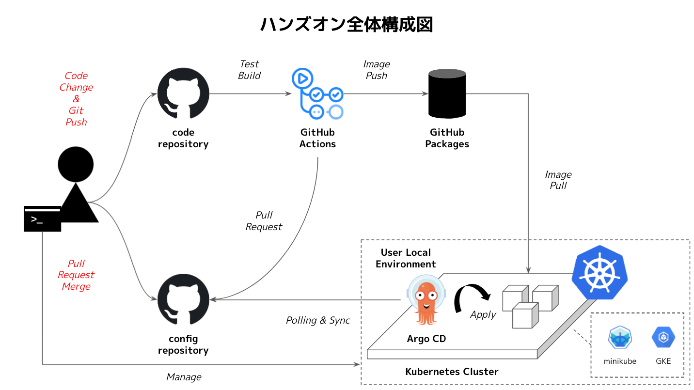
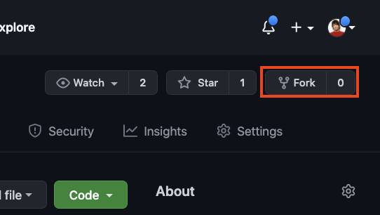

# Chapter 1

CI/CD Conference by CloudNative Days の Co-located ハンズオンイベント、**『Kubernetes で始める GitOps の基礎について』** にようこそ！

このハンズオンイベントでは、**Go + Web Assembly**を用いたアプリケーションを**Kubernetes**上で提供するシナリオで、**GitHub Actions**と**Argo CD**を用いてGitOpsによるCI/CD Pipelineを整備するハンズオンを実施していきます。
アプリケーションのテスト、コンテナイメージの最適化、よりセキュアなコンテナイメージの作成、Kubernetes への自動デプロイなどを実際に GitOps パイプラインを組みながら学んでいきます。

* 取り扱う技術
	* Go + Web Assembly
      * ※ ハンズオンにあたり、Web Assembly、Go の知識は必要ありません
	* GitHub
	* Kubernetes
	* GitHub Actions (CI tool)
	* Argo CD (CD tool)



## 章の構成

章は全部で9つのパートから構成されています。
一つ一つ順を追って手を動かしていくことで、通常のアプリケーションをコンテナ化し、Kubernetes上で稼働させ、継続的に更新し続けるCI/CD Pipelineを実現する方法を学ぶことができます。

|  Chapter  |  Title  | 概要 |
| ---- | ---- | ---- |
|0|[Preparation](./chapter0.md)|GitHub・Kubernetes・CLI等の準備をします（イベント当日までに行ってください）|
|1|[Introduction](./chapter1.md)|今回のハンズオンの概要と基礎知識について紹介します（このページです）|
|2|[Application](./chapter2.md)|Go + Web Assemblyで実装されたアプリケーションとアプリケーションに対するテストについて説明し、実際に実行して動作確認をします。|
|3|[Docker/Kubernetes fundamentals](./chapter3.md)|2章で実装したアプリケーションのコンテナ化し、Kubernetes上で実行します|
|4|[Optimize container image](./chapter4.md)|3章で作成したコンテナイメージの最適化を行っていきます|
|5|[CI pipeline by GitHub Actions](./chapter5.md)|3/4章で行っていた手作業をGitHub ActionsによるCI Pipelineで自動化します|
|6|[Application testing](./chapter6.md)|CIにテストを組み込み、アプリケーションの更新を継続的に行うことができる環境を整えます|
|7|[Secure container image](./chapter7.md)|コンテナイメージをセキュアに保つための仕組みをCIに導入します|
|8|[CD pipeline by ArgoCD](./chapter8.md)|3章で行っていた手作業をArgo CDによるGitOpsで自動化します|
|9|[CI/CD pipeline](./chapter9.md)|CIからCDにつなげる部分を実装し、完成したCI/CD Pipelineのテストを行います。|

## リポジトリの作成

今回のハンズオンで利用するリポジトリを作成します。
下記のリポジトリをそれぞれご自身のアカウントに**fork**して、各々のリポジトリを作成してください。

* https://github.com/cloudnativedaysjp/cicd-handson-2021-code
* https://github.com/cloudnativedaysjp/cicd-handson-2021-config

forkはGitHubの画面上の右上から行うことが可能です。



それぞれ下記のように皆さんのところにリポジトリが作成されていればOKです。

* https://github.com/GITHUB_USER/cicd-handson-2021-code
* https://github.com/GITHUB_USER/cicd-handson-2021-config

次に、ホームディレクトリ配下にcode用とconfig用のそれぞれのリポジトリをcloneして作業できるようにしてください。
Personal Access Tokenを利用して認証する方は「https://github.com/ 」から始まるURLを、SSH Keyを利用して認証する方は「git@github.com: 」から始まるURLを指定してください。

* Personal Access Tokenを利用する場合

```git
cd ~
git clone https://github.com/<GITHUB_USER>/cicd-handson-2021-code
git clone https://github.com/<GITHUB_USER>/cicd-handson-2021-config
```
* SSH Keysを利用する場合

```git
cd ~
git clone git@github.com:<GITHUB_USER>/cicd-handson-2021-code
git clone git@github.com:<GITHUB_USER>/cicd-handson-2021-config
```

以上でこのハンズオンで利用するファイル類の準備は完了です。

なお、このドキュメントのリポジトリはforkする必要はありません。

* https://github.com/cloudnativedaysjp/cicd-handson-2021

## GitHub Actionsで利用するSecretの追加

次に、後ほどGitHub Actionsで利用するためのSecretを「cicd-handson-2021-code」リポジトリに3つ追加します。
このGitHub Actions Secretを追加しておくことで、ActionsのStep実行時に値を利用して処理を行うことができます。

* https://github.com/<GITHUB_USER>/cicd-handson-2021-code/settings/secrets/actions/new


| 項目                    | 値                                |
| ---------------------- | --------------------------------- |
| USERNAME               | GitHubアカウント名                  |
| EMAIL                  | GitHub登録メールアドレス             |
| PERSONAL_ACCESS_TOKEN  | GitHub PAT（0章で作成したtoken.txt）|

---
[Chapter 2 Application](chapter2.md)へ