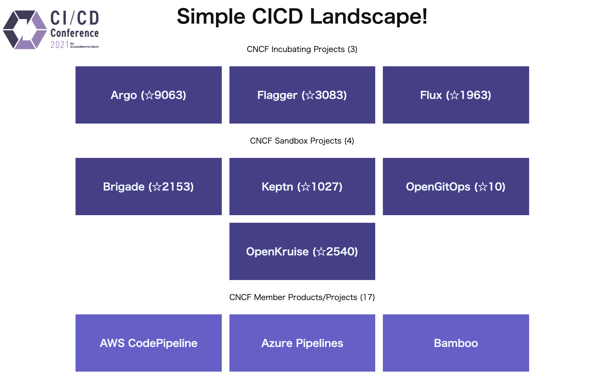

# Chapter 2 Application

ハンズオンで使用するデモアプリについて説明します。

## Simple CICD Landscape!

本アプリは [Cloud Native Landscape](https://landscape.cncf.io/) の中から、CICDに関するプロジェクトの一覧を表示します。



アプリ仕様

- CNCF Relation によるプロジェクトの分類
- クリックでプロジェクトの GitHub（ない場合はホームページ）へ移動
- GitHub のスター数をAPI経由で取得して表示
  - 起動中はメモリ上にキャッシュされる
- Description が設定されている場合はマウスオーバーで表示切り替え

構成

- シングルバイナリでWebページとAPIサーバをホスト
- Go言語で開発
  - WebAssembly
  - APIサーバ実装 ＋ テストコード

```txt
apps
├── common
│   ├── go.mod      # Local Package用
│   └── project.go
├── go.mod
├── go.sum
├── server
│   ├── landscape.go
│   ├── landscape_test.go # テストコード
│   └── server.go
├── wasm
│   └── main.go
└── web
    └── static
        ├── images
        ├── index.html
        ├── main.wasm  # ビルド済みWASMバイナリ
        ├── style.css
        └── wasm_exec.js

```

## WASM について

Webページの作成には WASM (WebAssembly) を使用しています。<br/>
WASM は JavaScript のようにブラウザで実行でき、JavaScript と協調して動作します。
JavaScript で記述する部分をGo言語で置き換えた、と思ってもらえれば良いです。

Go言語での WASM コードのビルドは次のように行います。
今回はビルド済みの WASMバイナリを用意していますので、WASM に関してハンズオンで意識する必要はありません。
（Windows環境でビルドしたバイナリは正常に動作しないため、すでにビルドしたものを利用してください。）

```bash
cd ./cicd-handson-2021-code/apps
GOOS=js GOARCH=wasm go build -o web/static/main.wasm ./wasm
```

参考：

[webassembly.org](https://webassembly.org/)<br/>
[WebAssembly の概要 | MDN - Mozilla](https://developer.mozilla.org/ja/docs/WebAssembly)<br/>
[Web Assembly + Go](https://medium.com/@rcougil/web-assembly-go-d01bbfc004cc)

## テスト・動作確認

作業環境に合わせたコマンドを実行してください。

### macOS, Linux

```bash
# apps ディレクトリに移動
cd ./cicd-handson-2021-code/apps

# テスト実行
go test ./server

# サーバ起動
go run ./server
```

### Windows

```bash
# apps ディレクトリに移動
cd .\cicd-handson-2021-code\apps

# テスト実行
go test .\server\

# サーバ起動
go run .\server\
```

現時点では、テストの実行結果は失敗となります。

サーバを起動後、次のいずれかの方法で動作確認を行ってください。

### コマンドラインで確認

ヘルスチェック用のエンドポイントにアクセスし、レスポンスを確認します。

```bash
curl http://127.0.0.1:9090/health

# json 形式のレスポンス
{
  "status": "Healthy"
}
```

### Webブラウザで確認

ブラウザで <http://127.0.0.1:9090> にアクセスし、Webページが表示されることを確認します。

ヘルスチェック用のエンドポイント (<http://127.0.0.1:9090/health>)、API 用のエンドポイント (<http://127.0.0.1:9090/landscape>) にもアクセス可能です。

## ※ 注意点

GitHub スター数の取得に利用している GitHub API には 60回/h の利用制限があり、これを超えるとスター数を取得できなくなります。<br/>
そのためアプリの再起動を数回行うとスター数が表示されなくなりますが、アプリの動作自体に影響はありません。

- 参考：<https://docs.github.com/en/rest/overview/resources-in-the-rest-api#rate-limiting>

なお、ヘルスチェック用エンドポイントにのみアクセスする場合は GitHub API は利用しません。
