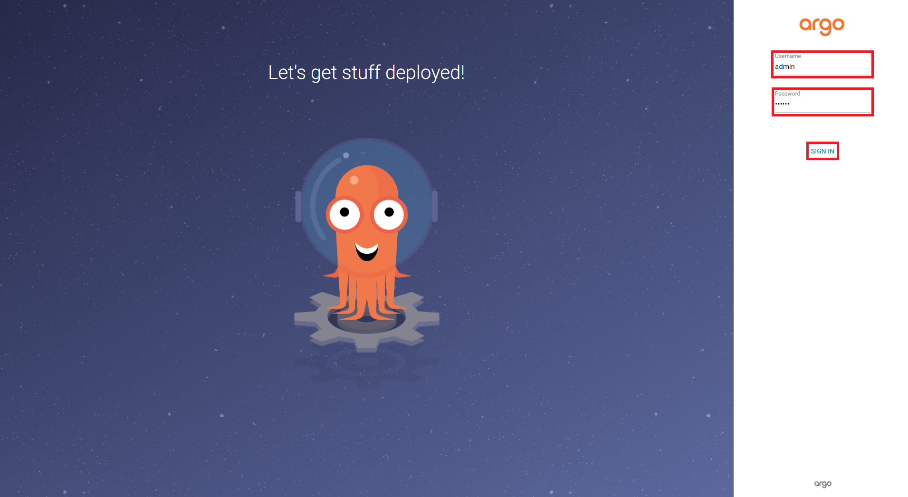
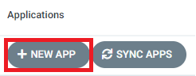
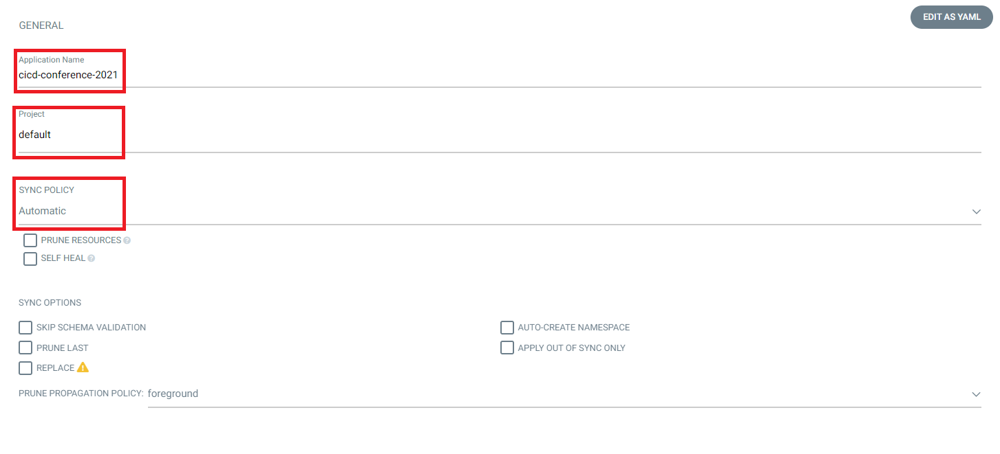
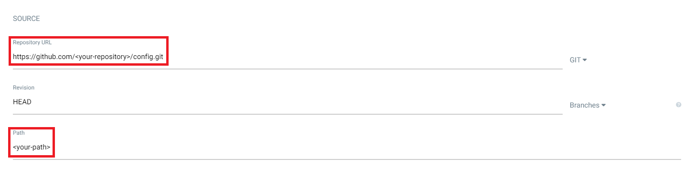
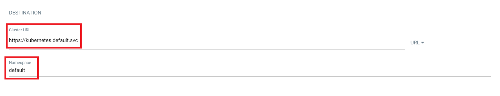
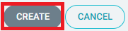
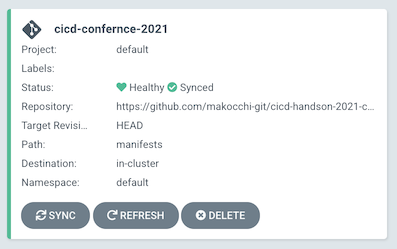
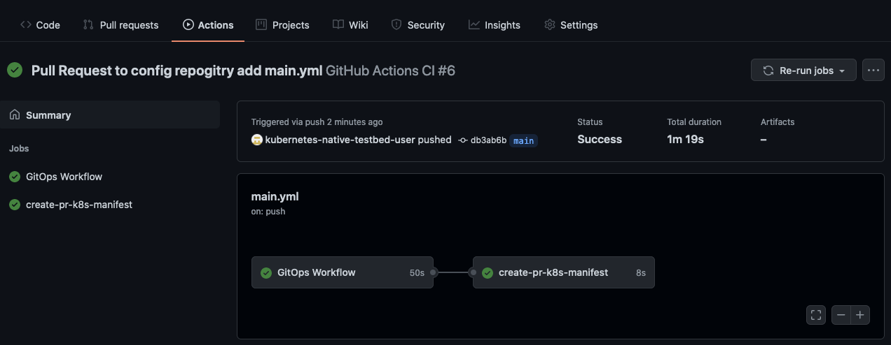
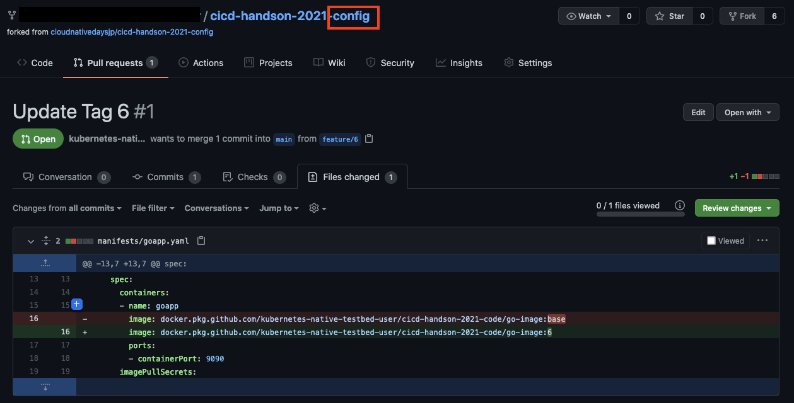
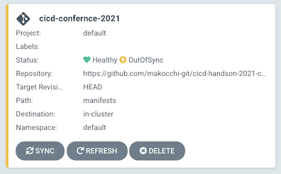

# Chapter 8 CD pipeline by Argo CD

GitOpsを実現する方法はいろいろありますが、本ハンズオンでは[Argo CD](https://argo-cd.readthedocs.io/en/stable/)を使ったハンズオンを行います。  
Argo CDの他には[Flux](https://fluxcd.io/)や[Jenkins X](https://jenkins-x.io/)などのソフトウェアもあります。  
Argo CDではリポジトリやデプロイ対象のKubernetesクラスターの設定を「Application」という概念で管理します。「Application」の設定はWebUIでもコマンドラインからも行うことができますので、Chapter 8では両方の設定の仕方を学びましょう。

## 8-1 Argo CDのInstall

Argo CDをKubernetesのクラスターにインストールします。

最初にArgo CD専用の `argocd` というNamespaceを作成します。

```bash
$ kubectl create namespace argocd
namespace/argocd created
```

Argo CDをインストールします。

```bash
$ kubectl apply -n argocd -f https://raw.githubusercontent.com/argoproj/argo-cd/v2.1.2/manifests/install.yaml
```

以下のPodがRunningになっていることを確認します。

```bash
$ kubectl get pods,services -n argocd
NAME                                      READY   STATUS    RESTARTS   AGE
pod/argocd-application-controller-0       1/1     Running   0          3m3s
pod/argocd-dex-server-68c7bf5fdd-b9l6v    1/1     Running   0          3m3s
pod/argocd-redis-7547547c4f-q2kb5         1/1     Running   0          3m3s
pod/argocd-repo-server-58f87478b8-r52fw   1/1     Running   0          3m3s
pod/argocd-server-6f4fcdc5dc-qfnjg        1/1     Running   0          3m3s

NAME                            TYPE        CLUSTER-IP       EXTERNAL-IP   PORT(S)                      AGE
service/argocd-dex-server       ClusterIP   10.102.102.212   <none>        5556/TCP,5557/TCP,5558/TCP   3m4s
service/argocd-metrics          ClusterIP   10.98.135.108    <none>        8082/TCP                     3m4s
service/argocd-redis            ClusterIP   10.101.136.116   <none>        6379/TCP                     3m4s
service/argocd-repo-server      ClusterIP   10.101.22.255    <none>        8081/TCP,8084/TCP            3m4s
service/argocd-server           ClusterIP   10.110.97.130    <none>        80/TCP,443/TCP               3m4s
service/argocd-server-metrics   ClusterIP   10.103.136.238   <none>        8083/TCP                     3m3s
```

## 8-2 Argo CDの認証設定

最初に初期パスワードを確認します。

※Windowsの場合、以下コマンドはコマンドプロンプトではbase64が無いというエラーが出るので、Git Bashで実行します。

```bash
$ kubectl -n argocd get secret argocd-initial-admin-secret -o jsonpath="{.data.password}" | base64 --decode; echo
xxxxxxxxxxxxxxxxxxx
```

Argo CDにアクセスできるようにプロキシ接続の設定を行います。

```bash
# kubectl port-forward は Ctrl + C でキャンセルしない限りプロンプトが戻ってきません
$ kubectl port-forward service/argocd-server 8080:443 -n argocd
```

Argo CD Serverにログインします。

※Windowsの場合は、以下コマンドはGit Bashでは証明書関連のエラーがでるので、コマンドプロンプトで「--insecure」オプションを外して実行します。

```bash
$ argocd login localhost:8080 --username admin --insecure
Password: # 先程のパスワードを入力します
'admin:login' logged in successfully
Context 'localhost:8080' updated
```

「logged in successfully」と表示されれば成功です。

続いて先程の初期パスワードを変更します。  
「Password updated」と表示されれば成功です。

```bash
$ argocd account update-password --account admin
*** Enter current password: # 先程のパスワードを入力します
*** Enter new password: # 任意のパスワードを入力します
*** Confirm new password: # もう一度任意のパスワードを入力します
Password updated
Context 'localhost:8080' updated
```

### TIPS

- 設定した admin パスワードを忘れてしまったら？

  新しく設定した admin のパスワードは argocd の namespace 内にある `argocd-secret` という Secret に格納されています。  
  Secret 内の `admin.password` 及び `admin.passwordMtime` を削除し、argocd-server の Pod を再作成することで初期パスワードが再作成されます。  
  その後再度 `argocd-initial-admin-secret` から初期パスワードを抽出し、「argocd login」をし直すことができます。

- 初期パスワードを変更せずに、そのまま使うことも可能です


## 8-3 Argo CDのWebUIの確認

ブラウザを起動して、`https://localhost:8080/` にアクセスします。

初回は、「この接続ではプライバシーが保護されません」と表示されますが、［詳細設定］をクリックして［EXTERNAL-IP にアクセスする（安全ではありません）］をクリックしてアクセスしてください。

WebUI画面で、「Username」は「admin」、「Password」は設定した任意のパスワードを入力して、「SIGN IN」をクリックしてログインします。

※Argo CDのWebUIが上手く表示されない場合は、「$ kubectl port-foward」コマンドを Ctrl + C でキャンセルして、もう一度以下のコマンドを実行してください。

```bash
$ kubectl port-forward service/argocd-server 8080:443 -n argocd
```



画面左上の「+ NEW APP」ボタンをクリックします。



GENERAL内の以下の項目を入力および設定します。

| 項目              | 値                  |
| ---------------- | ------------------- |
| Application Name | cicd-confernce-2021 |
| Project          | default             |
| SYNC POLICY      | Automatic            |



続いて SOURCE 内の以下の項目を入力および設定します。

| 項目              | 値                         |
| ---------------- | -------------------------- |
| Repository URL   | `https://github.com/<GITHUB_USER>/cicd-handson-2021-config` |
| Path             | manifests                  |



続いてDESTINATION内の以下の項目を入力および設定します。

| 項目           | 値                               |
| ------------- | -------------------------------- |
| Cluster URL   | `https://kubernetes.default.svc` |
| Namespace     | default                          |



上部の「Create」ボタンをクリックします。



configリポジトリとの連携設定は終了です。

### TIPS

- WebUIを使わずにargocdコマンドから設定することも可能です
  ```bash
  $ argocd app create cicd-confernce-2021 --repo https://github.com/YOUR_GITHUB/cicd-handson-2021-config --path manifests --dest-namespace default --dest-server https://kubernetes.default.svc --sync-policy automatic
  application 'cicd-confernce-2021' created
  ```
- 設定した内容は「argocd app list」で確認することができます
  ```bash
  $ argocd app list
  NAME                 CLUSTER                         NAMESPACE  PROJECT  STATUS  HEALTH   SYNCPOLICY  CONDITIONS  REPO                                                     PATH       TARGET
  cicd-confernce-2021  https://kubernetes.default.svc  default    default  Synced  Healthy  Auto        <none>      https://github.com/YOUR_GITHUB/cicd-handson-2021-config  manifests
  ```

しばらくすると作成した「cicd-conference-2021」のStatusが`Healthy`になることを確認します。



Kubernetesのクラスターにもデプロイされていることを確認します。

```bash
$ kubectl get pod
NAME                               READY   STATUS    RESTARTS   AGE
goapp-deployment-5f6588b9d-2q9h5   1/1     Running   0          9m13s
```


## 8-4 codeリポジトリ内の「main.yml」にconfigリポジトリへのプルリクエスト処理の追加

GitHub Actionsの「main.yml」にコンテナイメージタグの更新を契機にプルリクエストをconfigリポジトリに出す処理を追加します。

```yaml
name: GitHub Actions CI

# mainブランチへの「git push」をトリガー
on:
  push:
    branches: [ main ]

jobs:
  build:
    name: GitOps Workflow
    runs-on: ubuntu-latest
    steps:
      - name: Checkout code
        uses: actions/checkout@v2

        # アプリケーションテスト
      - name: Application test
        run: |
          cd apps
          make run-test

        # BuildKitによるコンテナイメージビルド
      - name: Build an image from Dockerfile
        run: |
          DOCKER_BUILDKIT=1 docker image build apps/ -t docker.pkg.github.com/${{ github.repository }}/go-image:${{ github.run_number }}

        # dockleによるイメージ診断
      - name: Run dockle
        uses: hands-lab/dockle-action@v1
        with:
          image: docker.pkg.github.com/${{ github.repository }}/go-image:${{ github.run_number }}

        # Trivyによるイメージスキャン
      - name: Run Trivy vulnerability scanner
        uses: aquasecurity/trivy-action@master
        with:
          image-ref: 'docker.pkg.github.com/${{ github.repository }}/go-image:${{ github.run_number }}'
          format: 'table'
          exit-code: '1'
          ignore-unfixed: true
          severity: 'CRITICAL,HIGH'

        # イメージをプッシュする為の「docker login」
      - name: GitHub Packages login
        uses: docker/login-action@v1
        with:
          registry: docker.pkg.github.com
          username: ${{ secrets.USERNAME }}
          password: ${{ secrets.PERSONAL_ACCESS_TOKEN }}

        # コンテナイメージをGitHub Packagesに「docker image push」
      - name: Push image to GitHub Packages
        run: docker image push docker.pkg.github.com/${{ github.repository }}/go-image:${{ github.run_number }}

  # プルリクエストを作る job を新規で定義します
  # 「needs: build」を書いておくことで、build の job が終わった後に実行されるようにします
  create-pr-k8s-manifest:
    needs: build
    runs-on: ubuntu-latest
    steps:
      # config repo を checkout します
      - name: Checkout code
        uses: actions/checkout@v2
        with:
          token: ${{ secrets.PERSONAL_ACCESS_TOKEN }}
          repository: ${{ secrets.USERNAME }}/cicd-handson-2021-config

        # プルリクエスト用の新規ブランチを作成し、プッシュした後にプルリクエストを作成します
      - name: Pull Request to Config Repository
        run: |
          # GitHubログイン設定
          echo -e "machine github.com\nlogin ${{ secrets.USERNAME }}\npassword ${{ secrets.PERSONAL_ACCESS_TOKEN }}" > ~/.netrc
          # GitHub Email/Username セットアップ
          git config --global user.email "${{ secrets.EMAIL }}"
          git config --global user.name "${{ secrets.USERNAME }}"
          # 新規ブランチ作成
          git branch feature/${{ github.run_number }}
          git checkout feature/${{ github.run_number }}
          # image tagを書き換えます
          sed -i -e "s|image: docker.pkg.github.com/${{ github.repository }}/go-image:.*|image: docker.pkg.github.com/${{ github.repository }}/go-image:${{ github.run_number }}|" manifests/goapp.yaml
          # プッシュ処理
          git add manifests
          git commit -m "Update tag ${{ github.run_number }}"
          git push origin feature/${{ github.run_number }}
          # プルリクエスト処理
          echo ${{ secrets.PERSONAL_ACCESS_TOKEN }} > token.txt
          gh auth login --with-token < token.txt
          gh pr create  --title "Update Tag ${{ github.run_number }}" --body "Please Merge !!"
```

```diff
diff --git a/.github/workflows/main.yml b/.github/workflows/main.yml
index 2a5d3c9..b1b1b69 100644
--- a/.github/workflows/main.yml
+++ b/.github/workflows/main.yml
@@ -50,3 +50,38 @@ jobs:

       - name: Push image to GitHub Packages
         run: docker image push docker.pkg.github.com/${{ github.repository }}/go-image:${{ github.run_number }}
+
+  # プルリクエストを作る job を新規で定義します
+  # 「needs: build」を書いておくことで、build の job が終わった後に実行されるようにします
+  create-pr-k8s-manifest:
+    needs: build
+    runs-on: ubuntu-latest
+    steps:
+      # config repo を checkout します
+      - name: Checkout code
+        uses: actions/checkout@v2
+        with:
+          token: ${{ secrets.PERSONAL_ACCESS_TOKEN }}
+          repository: ${{ secrets.USERNAME }}/cicd-handson-2021-config
+
+        # プルリクエスト用の新規ブランチを作成し、プッシュした後にプルリクエストを作成します
+      - name: Pull Request to Config Repository
+        run: |
+          # GitHubログイン設定
+          echo -e "machine github.com\nlogin ${{ secrets.USERNAME }}\npassword ${{ secrets.PERSONAL_ACCESS_TOKEN }}" > ~/.netrc
+          # GitHub Email/Username セットアップ
+          git config --global user.email "${{ secrets.EMAIL }}"
+          git config --global user.name "${{ secrets.USERNAME }}"
+          # 新規ブランチ作成
+          git branch feature/${{ github.run_number }}
+          git checkout feature/${{ github.run_number }}
+          # image tagを書き換えます
+          sed -i -e "s|image: docker.pkg.github.com/${{ github.repository }}/go-image:.*|image: docker.pkg.github.com/${{ github.repository }}/go-image:${{ github.run_number }}|" manifests/goapp.yaml
+          # プッシュ処理
+          git add manifests
+          git commit -m "Update tag ${{ github.run_number }}"
+          git push origin feature/${{ github.run_number }}
+          # プルリクエスト処理
+          echo ${{ secrets.PERSONAL_ACCESS_TOKEN }} > token.txt
+          gh auth login --with-token < token.txt
+          gh pr create  --title "Update Tag ${{ github.run_number }}" --body "Please Merge !!"
```

修正した「main.yml」をcodeリポジトリに「git push」して、CIが通って、configリポジトリにプルリクエストがあることを確認します。

```git
$ git add .github/workflows/main.yml
$ git commit -m "Pull Request to config repogitry add main.yml"
$ git push origin main
```



configリポジトリのプルリクエストの内容を確認して、マージします。  
その後作成されたimageがArgo CDによってKubernetesクラスターに展開されていることを確認します。  



### TIPS

- なかなか Sync されない場合は

  Argo CDは定期的にリポジトリの内容をSyncしていますが、タイミングによって少し時間がかかることがあります。  
  その場合は手動で「REFRESH」をクリックしてみてください。

Syncが確認できたらPodのイメージが変わっているか確認します。

```bash
$ kubectl describe pod -l app=goapp
...
...
Containers:
  goapp:
    Container ID:   docker://ccfca2ef0cb3d0296a8821c91bf0c691e15bb82a4ad7b143d75344929dd18fd3
    Image:          docker.pkg.github.com/<GITHUB_USER>/cicd-handson-2021-code/go-image:3
...
```

### TIPS

- 【時間に余裕がある人は】Podの数を増やしてみよう

  現在展開されているPodは1つのみです。これはgoapp.yamlのマニフェスト内で「replicas」の設定をしていない為、デフォルトである1が適用されていることによるものです。  
  Podの数を増やす為にgoapp.yamlで「replicas」を設定してみましょう。  

   ```bash
   # clone したディレクトリに移動します
   $ cd cicd-handson-2021-config

   # リポジトリを最新の状態にします
   $ git pull

   # vi 等で編集します
   $ vi manifests/goapp.yaml
   apiVersion: apps/v1
   kind: Deployment
   metadata:
     name: goapp-deployment
   spec:
     replicas: 3 # ここに追加
     selector:
       matchLabels:
         app: goapp
   ...

   # git push します
   $ git add manifests/goapp.yml
   $ git commit -m "set replicas"
   $ git push origin main

   # Argo CD で Sync されるのを待ちます
   $ kubectl get pod
   NAME                                READY   STATUS    RESTARTS   AGE
   goapp-deployment-6ff589b7c4-8mkwt   1/1     Running   0          11s
   goapp-deployment-6ff589b7c4-qv7p5   1/1     Running   0          11s
   goapp-deployment-6ff589b7c4-rq67g   1/1     Running   0          24m
   ```

   この例では「replicas: 3」にしていますが、数をいろいろ変えてみてください。

  「replicas」を設定する以外にも、[HPA](https://kubernetes.io/docs/tasks/run-application/horizontal-pod-autoscale/)(Horizontal Pod Autoscaler)を使ってPodの数を増減させる仕組みもありますので、是非試してみてください。

- 【さらに時間に余裕がある人は】GitOps経由ではなく、直接Podの数を変えた場合は？

   マニフェストを変更してリポジトリにプッシュすることでPodの数を変更しましたが、マニフェストを変更せずに直接Podの数を変更した場合はどのような挙動になるのでしょうか？  
   ここではPodの数を直接変更してみます。

   ```bash
   # kubectl patch を使って直接変更してみる
   $ kubectl patch deployment goapp-deployment -p '{"spec":{"replicas": 5}}'
   deployment.apps/goapp-deployment patched

   # Pod の数を確認
   $ kubectl get pod
   NAME                                READY   STATUS    RESTARTS   AGE
   goapp-deployment-6ff589b7c4-2snt7   1/1     Running   0          21s
   goapp-deployment-6ff589b7c4-65gcg   1/1     Running   0          21s
   goapp-deployment-6ff589b7c4-8mkwt   1/1     Running   0          8m23s
   goapp-deployment-6ff589b7c4-qv7p5   1/1     Running   0          8m23s
   goapp-deployment-6ff589b7c4-rq67g   1/1     Running   0          33m
   ```

   この状態では実際のKubernetesのクラスターとconfigリポジトリの間で不整合が発生していることになります。  
   Argo CDのWebUIを確認してみましょう。

   

   StatusがOutOfSyncになっているはずです。  
   Argo CDではデフォルトの挙動ではこのようなOutOfSyncな状態になった場合は手動でSyncする必要があります。
   Syncを押すことで元のPodの数に戻ることを確認しましょう。

   なお、自動でSyncさせるオプションも用意されています。  
   SYNC POLICYのselfHealを有効にすることで実現することができます。  
   詳しくは[公式のドキュメント](https://argo-cd.readthedocs.io/en/stable/user-guide/auto_sync/)を見てください。

---

[Chapter 9 CI/CD pipeline](chapter9.md)へ
