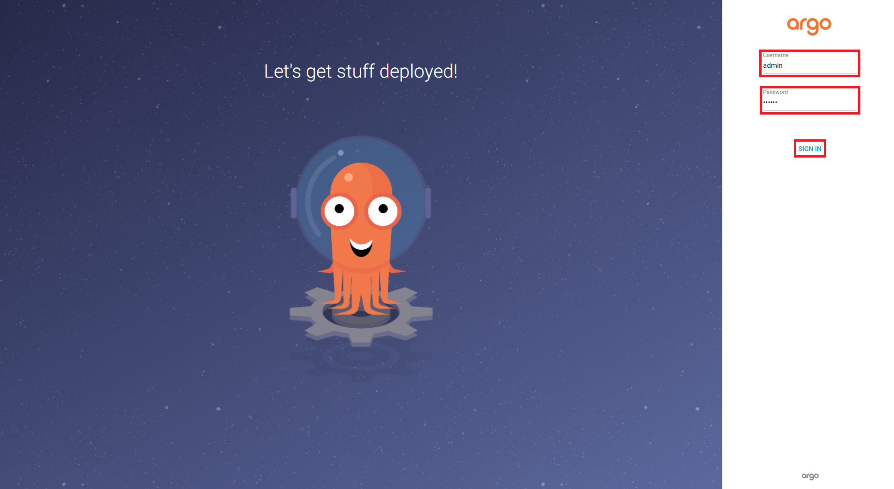
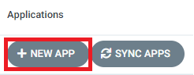
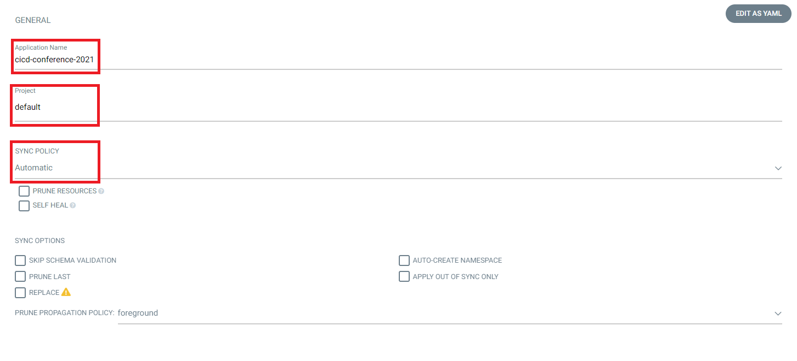
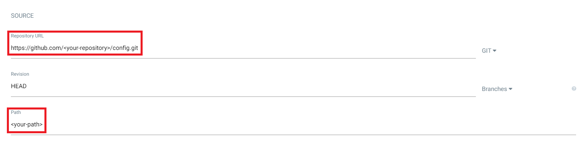
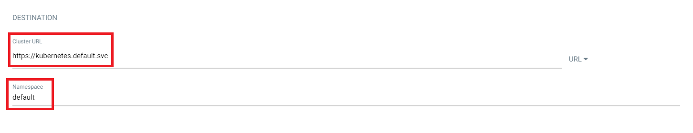
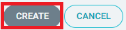

# Chapter 8 CD pipeline by ArgoCD

## 8-1 configリポジトリの作成

ご自身のGitHubに、「config」という名前のリポジトリを作成してください。

Repository name: config

パブリックを選択してください。

それ以外は、デフォルト設定のままで問題ありません。

「Create repository」ボタンをクリックします。

公式ドキュメント：https://docs.github.com/ja/github/getting-started-with-github/quickstart/create-a-repo

## 8-2 サンプルマニフェストファイルをクローン

ご自身のconfigリポジトリに「$ git push」するマニフェストファイルをクローンします。

```git
$ git clone https://github.com/cloudnativedaysjp/cicd-handson-2021.git
```

ご自身のconfigリポジトリに「$ git push」します。UsernameとPassword（Personal Access T000000oken）はご自身のものを入力してください。

```git
$ cd cicd-handson-2021/manifests
$ git init
$ git add .
$ git commit -m "first commit"
$ git branch -M main
$ git remote add origin https://github.com/<your-repogitryname>/config.git
$ git push -u origin main
```

## 8-3 ArgoCD Install

GitOpsでCDを実現するArgoCDをインストールします。

最初に ArgoCD専用の `argocd` という Namespace を作成します。

```kubectl
$ kubectl create namespace argocd
namespace/argocd created
```

ArgoCDをインストールします。

```kubectl
$ kubectl apply -n argocd -f https://raw.githubusercontent.com/argoproj/argo-cd/v2.0.5/manifests/install.yaml
```

以下のPodがRunningになっていることを確認します。

```kubectl
$ kubectl get pods,services -n argocd
NAME                                      READY   STATUS    RESTARTS   AGE
pod/argocd-application-controller-0       1/1     Running   0          3m3s
pod/argocd-dex-server-68c7bf5fdd-b9l6v    1/1     Running   0          3m3s
pod/argocd-redis-7547547c4f-q2kb5         1/1     Running   0          3m3s
pod/argocd-repo-server-58f87478b8-r52fw   1/1     Running   0          3m3s
pod/argocd-server-6f4fcdc5dc-qfnjg        1/1     Running   0          3m3s

NAME                            TYPE        CLUSTER-IP       EXTERNAL-IP   PORT(S)                      AGE
service/argocd-dex-server       ClusterIP   10.102.102.212   <none>        5556/TCP,5557/TCP,5558/TCP   3m4s
service/argocd-metrics          ClusterIP   10.98.135.108    <none>        8082/TCP                     3m4s
service/argocd-redis            ClusterIP   10.101.136.116   <none>        6379/TCP                     3m4s
service/argocd-repo-server      ClusterIP   10.101.22.255    <none>        8081/TCP,8084/TCP            3m4s
service/argocd-server           ClusterIP   10.110.97.130    <none>        80/TCP,443/TCP               3m4s
service/argocd-server-metrics   ClusterIP   10.103.136.238   <none>        8083/TCP                     3m3s
```

ArgoCDのWebUIにアクセスするために、プロキシ接続の設定を行います。

```kubectl
$ kubectl port-forward service/argocd-server 8080:443 -n argocd
```

ブラウザを起動して、`https://localhost:8080/` にアクセスします。

初回は、「この接続ではプライバシーが保護されません」と表示されますが、［詳細設定］をクリックして［EXTERNAL-IP にアクセスする（安全ではありません）］をクリックしてアクセスしてください。

次にWebUIの初期パスワードを変更します。

プロキシ接続用にターミナルを利用しているので、新規ターミナルを起動します。

最初に初期パスワードを確認します。

※Windowsの場合、以下コマンドはコマンドプロンプトではbase64が無いというエラーが出るので、Git Bashで実行します。

```argocd
$ kubectl -n argocd get secret argocd-initial-admin-secret -o jsonpath="{.data.password}" | base64 --decode
xxxxxxxxxxxxxxxxxxx
```

ArgoCD Serverにログインします。

※Windowsの場合は、以下コマンドはGit Bashでは証明書関連のエラーがでるので、コマンドプロンプトで実行します。

```argocd
$ argocd login localhost:8080 --username admin
```

「Enter current password:」は、初期パスワードを入力、「Enter new password:」と「Confirm new password:」は、任意のパスワードを入力してください。ここでは「argocd」とします。

```argocd
$ argocd account update-password
*** Enter current password:
*** Enter new password:
*** Confirm new password:
Password updated
Context 'localhost:8080' updated
```

`https://localhost:8080/` WebUI画面で、「Username」は「admin」、「Password」は「argocd」または設定した任意のパスワードを入力して、「SIGN IN」をクリックしてログインします。



画面左上の「+ NEW APP」ボタンをクリックします。



以下を入力および設定します。

Application Name: cicd-confernce-2021
Project: default
SYNC POLICY: Autmatic



Repository URL: ご自身のconfigリポジトリのURL
Path: 自動表示されたパス



Cluster URL: https://kubernetes.default.svc
Namespace: default



上部の「Create」ボタンをクリックします。



configリポジトリとの連携設定は終了です。


## 8-4「main.yml」にGitHub Packagesへのイメージプッシュ処理の追加

GitHub Actionsの「main.yml」にGitHub Packagesへのイメージプッシュ処理を追加します。

```
name: GitHub Actions CI

on:
  push:
    branches: [ main ]

jobs:
  build:
    name: GitOps Workflow
    runs-on: ubuntu-latest
    steps:
      - name: Checkout code
        uses: actions/checkout@v2

        # アプリケーションテスト
        #アプリケーションテストが成功する内容#

        # BuildKitによるコンテナイメージビルド
      - name: Build an image from Dockerfile
        run: |
          DOCKER_BUILDKIT=1 docker image build . -f app/Dockerfile -t docker.pkg.github.com/${{ github.repository }}/gitops-go-app:${{ github.run_number }}

        # dockleによるイメージ診断
      - name: Run dockle
        uses: hands-lab/dockle-action@v1
        with:
          image: docker.pkg.github.com/${{ github.repository }}/gitops-go-app:${{ github.run_number }}

        # Trivyによるイメージスキャン
      - name: Run Trivy vulnerability scanner
        uses: aquasecurity/trivy-action@master
        with:
          image-ref: 'docker.pkg.github.com/${{ github.repository }}/gitops-go-app:${{ github.run_number }}'
          format: 'table'
          exit-code: '1'
          ignore-unfixed: true
          severity: 'CRITICAL,HIGH'

        # コンテナイメージをGitHub Packagesに「docker image push」
      - name: GitHub Packages login
        uses: docker/login-action@v1
        with:
          registry: docker.pkg.github.com
          username: ${{ secrets.USERNAME }}
          password: ${{ secrets.PERSONAL_ACCESS_TOKEN }}
    
      - name: Push image to GitHub Packages
        run: docker image push docker.pkg.github.com/${{ github.repository }}/gitops-go-app:${{ github.run_number }}

        # コンテナイメージをGitHub Packagesにプッシュ
      - name: GitHub Packages login
        uses: docker/login-action@v1
        with:
          registry: docker.pkg.github.com
          username: ${{ secrets.USERNAME }}
          password: ${{ secrets.PERSONAL_ACCESS_TOKEN }}
    
      - name: Push image to GitHub Packages
        run: docker image push docker.pkg.github.com/${{ github.repository }}/gitops-go-app:${{ github.run_number }}
```

ここで、「main.yml」をcodeリポジトリに「$ git push」して、CIが通ることを確認します。

```git
$ git add .
$ git commit -m "Image Push add main.yml"
$ git branch -M main
$ git remote add origin https://github.com/<your-repogitryname>/config.git
$ git push -u origin main
```

## 8-5「main.yml」にconfigリポジトリへのプルリクエスト処理の追加

GitHub Actionsの「main.yml」にコンテナイメージタグの更新を契機にプルリクエストをconfigリポジトリに出す処理を追加します。

流れは、以下となります。

* GitHub Login
* Clone from Config Repogitry
* Email/Username Set Up
* New Branch Create
* Image Tag Update
* Git Commit & Push to Config Repositry
* Pull Request to Config Repositry

```
name: GitHub Actions CI

on:
  push:
    branches: [ main ]

jobs:
  build:
    name: GitOps Workflow
    runs-on: ubuntu-latest
    steps:
      - name: Checkout code
        uses: actions/checkout@v2

        # アプリケーションテスト
        #アプリケーションテストが成功する内容#

        # BuildKitによるコンテナイメージビルド
      - name: Build an image from Dockerfile
        run: |
          DOCKER_BUILDKIT=1 docker image build . -f app/Dockerfile -t docker.pkg.github.com/${{ github.repository }}/gitops-go-app:${{ github.run_number }}

        # dockleによるイメージ診断
      - name: Run dockle
        uses: hands-lab/dockle-action@v1
        with:
          image: docker.pkg.github.com/${{ github.repository }}/gitops-go-app:${{ github.run_number }}

        # Trivyによるイメージスキャン
      - name: Run Trivy vulnerability scanner
        uses: aquasecurity/trivy-action@master
        with:
          image-ref: 'docker.pkg.github.com/${{ github.repository }}/gitops-go-app:${{ github.run_number }}'
          format: 'table'
          exit-code: '1'
          ignore-unfixed: true
          severity: 'CRITICAL,HIGH'

        # コンテナイメージをGitHub Packagesに「docker image push」
      - name: GitHub Packages login
        uses: docker/login-action@v1
        with:
          registry: docker.pkg.github.com
          username: ${{ secrets.USERNAME }}
          password: ${{ secrets.PERSONAL_ACCESS_TOKEN }}
    
      - name: Push image to GitHub Packages
        run: docker image push docker.pkg.github.com/${{ github.repository }}/gitops-go-app:${{ github.run_number }}

        # コンテナイメージをGitHub Packagesにプッシュ
      - name: GitHub Packages login
        uses: docker/login-action@v1
        with:
          registry: docker.pkg.github.com
          username: ${{ secrets.USERNAME }}
          password: ${{ secrets.PERSONAL_ACCESS_TOKEN }}
    
      - name: Push image to GitHub Packages
        run: docker image push docker.pkg.github.com/${{ github.repository }}/gitops-go-app:${{ github.run_number }}

        # values.yamlの更新、新規ブランチ作成、プッシュ、プルリクエスト
      - name: Update values.yaml & Pull Request to Config Repository
        run: |
          # GitHubログイン
          echo -e "machine github.com\nlogin ${{ secrets.USERNAME }}\npassword ${{ secrets.GH_PASSWORD }}" > ~/.netrc
          # 「config」リポジトリからクローン
          git clone https://github.com/${{ secrets.USERNAME }}/config.git
          # GitHub Email/Username セットアップ
          cd config/gitops-helm
          git config --global user.email "${{ secrets.EMAIL }}"
          git config --global user.name "${{ secrets.USERNAME }}"
          # 新規ブランチ作成
          git branch feature/${{ github.run_number }}
          git checkout feature/${{ github.run_number }}
          # values.yamlのタグ番号を更新
          sed -i 's/tag: [0-9]*/tag: ${{ github.run_number }}/g' values.yaml
          # プッシュ処理
          git add values.yaml
          git commit -m "Update tag ${{ github.run_number }}"
          git push origin feature/${{ github.run_number }}
          # プルリクエスト処理
          echo ${{ secrets.PERSONAL_ACCESS_TOKEN }} > token.txt
          gh auth login --with-token < token.txt
          gh pr create  --title "Update Tag ${{ github.run_number }}" --body "Please Merge !!"
```

ここで、「main.yml」をcodeリポジトリに「$ git push」して、CIが通って、configリポジトリにプルリクエストがあることを確認します。

```git
$ git add .
$ git commit -m "Pull Request to config repogitry add main.yml"
$ git branch -M main
$ git remote add origin https://github.com/<your-repogitryname>/config.git
$ git push -u origin main
```