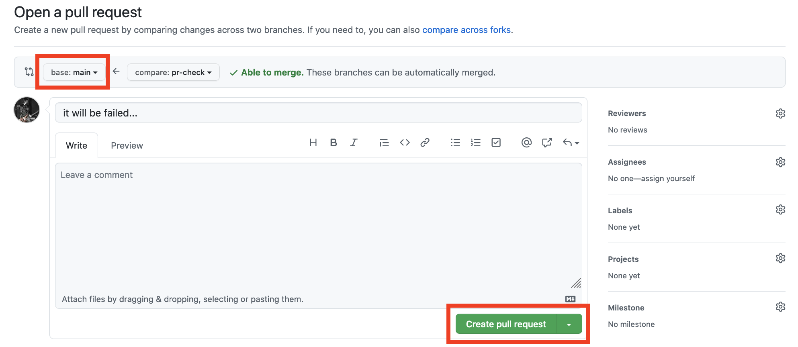

# Chapter 9 CI/CD pipeline

本チャプターまでたどり着いた皆様、おめでとうございます。  
ここまでの手順が達成できていれば、CI/CDは完成していると言えるでしょう。  
しかしここで満足してはいけません。本ドキュメントは基本的なCI/CDを紹介したに過ぎません。  
世の中には様々なシステムがあり、そのシステムに合ったCI/CDもそれぞれ存在します。  
是非さまざまなあなた自身のCI/CDを組んでみて下さい。  
そして上手くいった時は是非カンファレンスやコミュニティイベントで発表してください。

最後のステップとして、本チャプターではアプリケーションを更新し、CIからCDまできちんと処理されることを再度確認します。

## 9-1 アプリケーションの更新

アプリケーションを以下の手順で更新します。  
cssを編集して「Simple CICD Landscape!」の文字の色を変更します。

```bash
# git clone した code リポジトリで作業します
# vi 等で color の部分を #ff33cc に変更します
$ vi apps/web/static/style.css
h1{
    text-align: center;
    font-size: 40px;
    color: #ff33cc;
}

# リポジトリへプッシュします
$ git add apps/web/static/style.css
$ git commit -m "change title color"
$ git push origin main
```

GitHub ActionsのCIの実行、GitHub Packagesへのコンテナイメージ保存、configリポジトリへのプルリクエストまでできることを確認します。

その後、configリポジトリのプルリクエストをマージします。

Argo CDによって同期されるのを待ちます。(もしくは手動でSyncさせます)  
Syncが終わったらアプリケーションを表示させます。  
「kubectl port-forward」した後に `http://localhost:9090/` にアクセスします。

```bash
$ kubectl port-forward deployment.apps/goapp-deployment 9090:9090
```

タイトルの色が変わっていれば成功です。
（更新されない場合は、ブラウザのハードリロードも試してみてください。）


## 9-2 アプリケーション変更のプルリクエスト時にテストを流す

9-1 の手順ではアプリケーションの更新後、プルリクエストを作らずにそのままmainへプッシュしました。  
本来であればこのような手順は好ましくありません。テストが通らなくなってしまう変更は避けるべきです。  
そこでcodeリポジトリのGitHub Actionsを変更し、プルリクエスト時にテストが流れるように変更します。

```bash
# 新規ファイルで pr-check.yml を用意します
$ vi .github/workflows/pr-check.yml
```

下記の内容を pr-check.yml に書き込みます。

```yaml
name: Pull Request Check

# mainブランチへのプルリクエスト時にトリガー
on:
  pull_request:
    branches: [ main ]

jobs:
  check:
    name: Application test
    runs-on: ubuntu-latest
    steps:
      - name: Checkout code
        uses: actions/checkout@v2

        # アプリケーションテスト
      - name: Application test
        run: |
          cd apps
          make run-test
```

pr-check.yml をリポジトリにプッシュします。

```bash
$ git add .github/workflows/pr-check.yml
$ git commit -m "add pr-check action"
$ git push origin main
```

## TIPS

- pr-check.yml を追加する時のプッシュによってGitHub Actionsが動くことになると思います。  
  本来であればアプリケーションの変更に関係ないファイルの更新時にはアプリケーションのビルドはしなくていい場合が多いと思います。  
  その場合はGitHub Actionsの設定で、特定のパスのファイルが更新されたらアプリケーションをビルドするGitHub Actionsを動かす、もしくはその逆で特定のパスのファイルの更新を無視する、といった柔軟な設定をすることができます。  
  上手く使いこなして下さい。([公式Document](https://docs.github.com/en/actions/reference/workflow-syntax-for-github-actions#onpushpull_requestpaths))

アプリケーションを更新するプルリクエストを作成します。  
今回はテストに失敗するような変更にするため、chap 6-2で直したコードを元に戻すプルリクエストを作成します。

```bash
# エディタ等で修正します
$ vi apps/server/landscape.go
...
...
 92                                                 go func(i int, proj SubItem) {
 93                                                         defer wg.Done()
 94                                                         list[i] = Project{
 95                                                                 Name:        proj.Name,
 96                                                                 Description: proj.Description,
 97                                                                 HomepageUrl: proj.HomepageUrl,
 98                                                                 Project:     getProject(proj.Project, proj.Crunchbase, ml),
 99                                                                 RepoUrl:     proj.RepoUrl,
100                                                                 Crunchbase:  proj.Twitter, #ここを Twitterに戻す
101                                                                 StarCount:   getStarCount(proj.RepoUrl),
102                                                         }
103                                                 }(i, proj)

# プルリクエスト用のbranchを作成し、プッシュします
$ git branch pr-check
$ git checkout pr-check
$ git add apps/server/landscape.go
$ git commit -m "it will be failed..."
$ git push origin pr-check
```

プルリクエストを作成します。  
codeリポジトリをブラウザで開き、「branches」をクリックします。


`pr-check` ブランチの「New pull request」をクリックします。


「base」の部分を**ご自身のリポジトリの main**に変更します。  
その後「Create pull request」をクリックします。



プルリクエストを作成後、GitHub Actionsが実行されます。  
プルリクエストの画面を見ると失敗していることが確認できると思います。


このようにプルリクエスト時にチェックをすることは、アプリケーションの品質向上に役立つことになります。  
ぜひやり方を覚えて、ご自身のシステム開発に役立てて下さい。

### TIPS

- コマンドラインからプルリクエストを作成する

  gh コマンドが使えるのであればコマンドラインからプルリクエストを作成することができます。  

   ```bash
   $ gh pr create --title "pr-check test" --body "pr-check test" --base main
   ```

## 9-3 削除処理

学習終了後に各ツールの削除処理を実行してください。
削除処理のタイミングは、ご自身にお任せします。

この処理を実行するとこれまで作成してきたデータ等は削除されるので、
必要な場合はご自身でバックアップをお願いします。

### GitHub

GitHubに作成したものを削除します。

* codeとconfigリポジトリ

  https://docs.github.com/ja/github/administering-a-repository/managing-repository-settings/deleting-a-repository

* Personal Access Token

  以下URLにアクセスして、対象となるTokenリストにある「Delete」ボタンをクリックして削除してください。

  https://github.com/settings/tokens

### minikube

Kubernetesクラスタを削除します。

```bash
$ minikube delete
```

### Others

事前準備でインストールした以下アプリケーションは、不要であればアンインストールしてください。

* Git（Windows環境のみ）
* minikube
* Docker Desktop for Win/Mac
* Argo CD CLI

#### Windows

以下については、[コントロールパネル]-[プログラムと変更]から、対象のツールを選んでアンインストールしてください。

* Git（Windows環境のみ）
* minikube
* Docker Desktop for Win

以下については、任意のディレクトリに格納したexeファイルを削除してください。
通したパスも不要であれば削除してください。

パス設定参考サイト: https://www.atmarkit.co.jp/ait/articles/1805/11/news035.html

* Argo CD CLI

#### Mac

* minikube

  Homebrewの場合

  ```bash
  $ brew uninstall minikube
  ```

  Binaryの場合

  ```bash
  $ rm /usr/local/bin/minikube
  ```

* Docker Desktop for Mac

  https://docs.docker.com/docker-for-mac/install/

* Argo CD CLI

  ```brew
  $ brew uninstall argocd
  ```

#### GCP

* GKE

  GCPダッシュボードの場合、対象となるKubernetesクラスタを選択して、削除してください。

  gcloudコマンドの場合

  ```bash
  $ gcloud container clusters delete cicd-cluster --zone <your-zone> --async
  ```

* Argo CD CLI

  ```bash
  $ rm ~/argocd/bin/argocd
  ```
---

ハンズオンは以上になります。お疲れさまでした！
